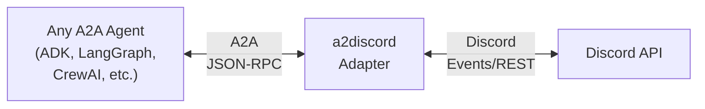

# a2discord

**Discord adapter for A2A agents** — map any agent to a Discord bot using [A2A](https://github.com/google/A2A), [A2UI](https://a2ui.org), and A2H conventions.

## What This Is

**Not a bridge bot.** An adapter layer that any A2A-compliant agent plugs into.



**Agent developers speak A2A.** The adapter handles Discord translation.

## A2A on Discord

[A2A](https://github.com/google/A2A) (Agent-to-Agent) protocol primitives map directly to Discord:

| A2A Concept | Discord Primitive |
|-------------|-------------------|
| Agent Card | Bot profile + slash commands |
| Task | Thread (lifecycle isolation) |
| Message | Discord message |
| Streaming | Message edits |
| Task states | Thread metadata / status embeds |

Each A2A task gets its own Discord thread — conversations stay isolated, context stays scoped.

## A2UI on Discord

[A2UI](https://a2ui.org) structured UI components render as native Discord components:

| A2UI Component | Discord Component |
|----------------|-------------------|
| Container, Section | Embed |
| Button (up to 5/row) | Action Row → Buttons |
| Select Menu | Dropdown (string, user, role, channel) |
| Text Display | Embed field or message content |
| Modal/Form | Discord Modal (up to 5 text inputs) |
| Media Gallery | Attachment embeds |

Unsupported A2UI components (charts, canvas, custom rendering) gracefully fall back to text descriptions or image snapshots.

## A2H Conventions on Discord

A2H (Agent-to-Human) interaction patterns map to Discord's native interaction model:

| A2H Intent | Discord Primitive |
|------------|-------------------|
| INFORM | Embed or plain message (fire-and-forget) |
| COLLECT | Modal form or select menus |
| AUTHORIZE | Button row (✅/❌) + optional thread for context |
| ESCALATE | Mention/ping a human, open thread |
| RESULT | Edit original message with outcome |

Discord's interaction model (buttons, modals, select menus) is a natural fit for structured human-in-the-loop workflows. Messages are edited with outcomes after interaction — collapse after interaction.

## Quick Start

```bash
# Install dependencies
uv sync

# Configure
cp .env.example .env
# Edit .env with your Discord bot token and A2A agent URL

# Run
uv run python -m a2discord
```

## Architecture

See [docs/DESIGN.md](docs/DESIGN.md) for the full architecture and mapping specification.

See [docs/ROADMAP.md](docs/ROADMAP.md) for the development plan.

## License

MIT
