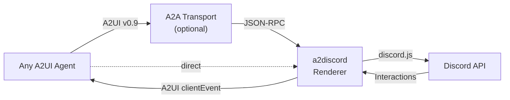

# a2discord

**Discord transport adapter for A2UI agents** — any agent that speaks [A2UI](https://a2ui.org) gets native Discord rendering via a component catalog.

## How It Works

```
Agent → A2UI v0.9 JSON → a2discord renderer → Discord embeds, buttons, modals
User clicks button     → a2discord adapter  → A2UI clientEvent → Agent receives
```

The agent doesn't import `discord.js`. It composes UI using the **Discord component catalog** — a set of 7 Discord-native components defined as A2UI v0.9 JSON Schema. The adapter renders them as native Discord primitives.

<!-- TODO: Add screenshot showing the quiz question with True/False buttons -->


**→ [Full end-to-end walkthrough](docs/END_TO_END_WALKTHROUGH.md)** — traces a single interaction through every layer.

## Discord Component Catalog

a2discord defines a Discord-specific [A2UI component catalog](catalog/discord_catalog.json):

| Catalog Component | Discord Primitive | Example Use |
|---|---|---|
| `DiscordMessage` | Message | Top-level container |
| `DiscordEmbed` | Embed | Structured info cards |
| `DiscordButton` | Button | Actions, confirmations |
| `DiscordActionRow` | Action Row | Button/select container |
| `DiscordSelectMenu` | Select Menu | Dropdowns, choices |
| `DiscordModal` | Modal | Forms, data collection |
| `DiscordTextInput` | Text Input | Modal form fields |

Agents receive this catalog via [A2UI catalog negotiation](https://a2ui.org/catalogs/). The same agent given a Slack catalog would render native Slack UI. **The agent is surface-agnostic.**

## A2A Transport (Optional)

[A2A](https://a2a-protocol.org) is the transport layer, not the UI layer. Use it when the agent is a separate process:

```
Remote agent: Agent ←A2A JSON-RPC→ a2discord ←Discord API→ Discord
Local agent:  Agent ←A2UI directly→ a2discord ←Discord API→ Discord
```

A2A wraps A2UI messages in `tasks/send` JSON-RPC calls. a2discord extracts and renders them. If the agent is co-located, skip A2A entirely.

## A2H Interaction Patterns

A2H conventions map to Discord's interaction model:

| Intent | Discord Rendering |
|--------|-------------------|
| **INFORM** | Blue embed |
| **AUTHORIZE** | Orange embed + ✅/❌ buttons |
| **COLLECT** | Embed + modal form |
| **RESULT** | Green/red embed (success/failure) |
| **ESCALATE** | @mention + thread |

## Quick Start

```bash
# Install
bun install

# Configure
cp .env.example .env
# Set DISCORD_TOKEN and optionally A2A_AGENT_URL

# Run demo bot (deterministic, no agent needed)
bun run demo

# Run adapter (connects to A2A agent)
bun run dev
```

See the [User Guide](docs/USER_GUIDE.md) for Discord bot setup.

## Architecture



## Docs

- **[End-to-End Walkthrough](docs/END_TO_END_WALKTHROUGH.md)** — full step-by-step with wire format examples
- **[Design](docs/DESIGN.md)** — architecture, layer model, mapping spec
- **[A2UI Mapping](docs/A2UI-MAPPING.md)** — component mapping reference
- **[Roadmap](docs/ROADMAP.md)** — development phases
- **[Decisions](docs/DECISIONS.md)** — ADRs

## Status

Phase 1 MVP complete — Discord catalog, renderer, demo bot, test suite (134 tests), live E2E verified.

## License

MIT
