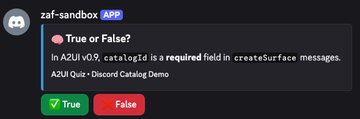
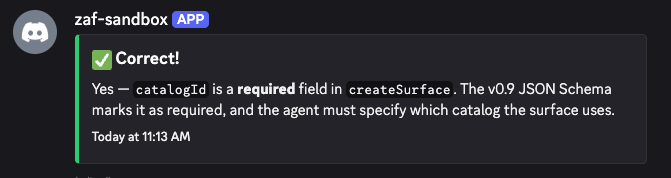

# End-to-End Walkthrough: A2UI on Discord

This walkthrough traces a single interaction — an agent asking a true/false question — through every layer of the a2discord stack. It demonstrates how A2UI component catalogs enable surface-agnostic agent UI.

## Architecture Overview

```
Agent Intent → A2UI v0.9 JSON → (optional A2A transport) → a2discord renderer → Discord API → User sees UI
User clicks  → Discord Interaction → a2discord adapter → A2UI clientEvent → (optional A2A) → Agent receives
```

## The Scenario

An agent wants to quiz the user:

> **"True or False: In A2UI v0.9, `catalogId` is required in `createSurface` messages."**

The agent doesn't know it's talking to Discord. It only knows it has a Discord component catalog available.

---

## Step 1: Agent Intent

The agent decides to ask a question. It knows its available components because it received the **Discord catalog** during negotiation.

```
Agent reasoning:
"I want to verify the user's understanding of A2UI catalogs.
My surface supports DiscordEmbed and DiscordButton —
I'll compose a question card with two answer buttons."
```

The agent doesn't import `discord.js`. It doesn't know about embeds or action rows. It knows `DiscordEmbed`, `DiscordButton`, and `DiscordActionRow` from the catalog schema — just like it would know `SlackSection` and `SlackButton` if talking to Slack.

## Step 2: Agent Emits A2UI v0.9 Messages

The agent produces standard A2UI v0.9 wire format. Note the `textFallback` on the root component — any surface that can't render the catalog still gets a usable text version.

```json
[
  {
    "version": "v0.9",
    "createSurface": {
      "surfaceId": "quiz-q1",
      "catalogId": "https://github.com/zeroasterisk/a2discord/catalog/v1/discord_catalog.json"
    }
  },
  {
    "version": "v0.9",
    "updateComponents": {
      "surfaceId": "quiz-q1",
      "components": [
        {
          "id": "root",
          "component": "DiscordMessage",
          "textFallback": "True or False: In A2UI v0.9, catalogId is required in createSurface messages. Reply TRUE or FALSE.",
          "embeds": [
            {
              "id": "question",
              "component": "DiscordEmbed",
              "title": "🧠 True or False?",
              "description": "In A2UI v0.9, `catalogId` is a **required** field in `createSurface` messages.",
              "color": "#3498db",
              "footer": "A2UI Quiz • Discord Catalog Demo"
            }
          ],
          "components": [
            {
              "id": "answers",
              "component": "DiscordActionRow",
              "children": [
                {
                  "id": "btn-true",
                  "component": "DiscordButton",
                  "label": "✅ True",
                  "style": "success",
                  "customId": "answer-true"
                },
                {
                  "id": "btn-false",
                  "component": "DiscordButton",
                  "label": "❌ False",
                  "style": "danger",
                  "customId": "answer-false"
                }
              ]
            }
          ]
        }
      ]
    }
  }
]
```

## Step 3: A2A Transport (Optional)

A2A is the **transport protocol**, not the UI protocol. It's needed when the agent is a separate process/server. If the agent runs inside a2discord directly, this step is skipped.

**With A2A** (remote agent):
```json
{
  "jsonrpc": "2.0",
  "id": 1,
  "method": "tasks/send",
  "params": {
    "id": "task-quiz-001",
    "message": {
      "role": "agent",
      "parts": [
        {
          "type": "data",
          "data": {
            "a2ui": [
              { "version": "v0.9", "createSurface": { "..." : "..." } },
              { "version": "v0.9", "updateComponents": { "..." : "..." } }
            ]
          }
        },
        {
          "type": "text",
          "text": "True or False: catalogId is required in createSurface. Reply TRUE or FALSE."
        }
      ],
      "metadata": {
        "a2uiClientCapabilities": {
          "supportedCatalogIds": [
            "https://github.com/zeroasterisk/a2discord/catalog/v1/discord_catalog.json"
          ]
        }
      }
    }
  }
}
```

**Without A2A** (co-located agent):
The agent emits A2UI messages directly to the renderer. No JSON-RPC wrapping.

> **Key insight: A2A = transport. A2UI = UI. They are independent protocols.**

## Step 4: a2discord Renderer Translates A2UI → Discord

The `DiscordCatalogRenderer` walks the A2UI component tree and produces discord.js objects:

```typescript
// Input:  A2UI v0.9 updateComponents message
// Output: discord.js MessageCreateOptions

{
  embeds: [
    new EmbedBuilder()
      .setTitle('🧠 True or False?')
      .setDescription('In A2UI v0.9, `catalogId` is a **required** field...')
      .setColor(0x3498db)
      .setFooter({ text: 'A2UI Quiz • Discord Catalog Demo' })
  ],
  components: [
    new ActionRowBuilder().addComponents(
      new ButtonBuilder()
        .setCustomId('answer-true')
        .setLabel('✅ True')
        .setStyle(ButtonStyle.Success),
      new ButtonBuilder()
        .setCustomId('answer-false')
        .setLabel('❌ False')
        .setStyle(ButtonStyle.Danger)
    )
  ]
}
```

The adapter sends this to the Discord API via `channel.send(options)` and stores the mapping: `customId → surfaceId + componentId` for routing interactions back.

## Step 5: Discord Renders the Question

Discord displays a blue embed with the question text and two buttons (True/False).



The user sees native Discord UI — an embed with interactive buttons. No web views, no iframes, no custom rendering. Pure Discord components.

## Step 6: User Clicks → Reverse Flow

The user clicks **✅ True**. Here's what happens at each layer:

### 6a. Discord → a2discord Adapter

Discord fires an `InteractionCreate` event:

```json
{
  "type": 3,
  "data": {
    "custom_id": "answer-true",
    "component_type": 2
  },
  "user": {
    "id": "172053288110260225",
    "username": "zeroasterisk"
  },
  "message": { "id": "1481671433519108151" }
}
```

### 6b. a2discord Translates → A2UI Client Event

The adapter looks up `customId: "answer-true"` and maps it back to the A2UI surface:

```json
{
  "version": "v0.9",
  "clientEvent": {
    "surfaceId": "quiz-q1",
    "componentId": "btn-true",
    "eventType": "click",
    "value": "answer-true",
    "userId": "172053288110260225"
  }
}
```

### 6c. Forward to Agent (if using A2A)

```json
{
  "jsonrpc": "2.0",
  "id": 2,
  "method": "tasks/send",
  "params": {
    "id": "task-quiz-001",
    "message": {
      "role": "user",
      "parts": [{
        "type": "data",
        "data": {
          "a2ui": [{
            "version": "v0.9",
            "clientEvent": {
              "surfaceId": "quiz-q1",
              "componentId": "btn-true",
              "eventType": "click"
            }
          }]
        }
      }]
    }
  }
}
```

### 6d. Agent Processes the Interaction

```
Agent reasoning:
"User clicked 'btn-true' on quiz-q1. The correct answer IS true.
I'll update the surface to show a success result and remove the buttons."
```

### 6e. Agent Updates the Surface

```json
{
  "version": "v0.9",
  "updateComponents": {
    "surfaceId": "quiz-q1",
    "components": [{
      "id": "root",
      "component": "DiscordMessage",
      "embeds": [{
        "id": "result",
        "component": "DiscordEmbed",
        "title": "✅ Correct!",
        "description": "Yes — `catalogId` is a **required** field in `createSurface`. The v0.9 JSON Schema marks it as required.",
        "color": "#2ecc71"
      }],
      "components": []
    }]
  }
}
```

a2discord renders this → Discord edits the original message → green embed replaces blue, buttons removed.



## Step 7: Continue the Conversation

The agent can proceed to the next question by creating a new surface or updating the existing one. The cycle repeats:

```
Agent emits A2UI → a2discord renders → Discord shows → User interacts → a2discord translates → Agent receives
```

---

## Why This Matters

### Surface-Agnostic Agents
The agent never imported `discord.js`. It composed UI using catalog components. Give the same agent a Slack catalog → it composes Slack blocks. A web catalog → it composes HTML/React. **The agent is decoupled from the surface.**

### Catalog as Contract
The Discord catalog (`discord_catalog.json`) defines exactly 7 components: `DiscordMessage`, `DiscordEmbed`, `DiscordButton`, `DiscordActionRow`, `DiscordSelectMenu`, `DiscordModal`, `DiscordTextInput`. The agent can only compose with these. The renderer knows exactly what to expect.

### Text Fallback
Every `DiscordMessage` can include a `textFallback` — if the surface can't render the catalog, the agent's intent is still communicated as plain text. Graceful degradation is built into the protocol.

### A2A is Optional
A2UI works with or without A2A transport. Co-located agents emit A2UI directly. Remote agents wrap A2UI in A2A JSON-RPC. The renderer doesn't care how the A2UI arrived.

---

## Component Catalog Reference

| Discord Catalog Component | Discord Primitive | Notes |
|---|---|---|
| `DiscordMessage` | `MessageCreateOptions` | Top-level container with content, embeds, components |
| `DiscordEmbed` | `EmbedBuilder` | Title, description, color, fields, images, footer |
| `DiscordButton` | `ButtonBuilder` | Primary, secondary, success, danger, link styles |
| `DiscordActionRow` | `ActionRowBuilder` | Container for buttons (max 5) or one select menu |
| `DiscordSelectMenu` | `StringSelectMenuBuilder` | Dropdown with up to 25 options |
| `DiscordModal` | `ModalBuilder` | Popup form triggered by button click |
| `DiscordTextInput` | `TextInputBuilder` | Short or paragraph text input inside modals |

See [`catalog/discord_catalog.json`](../catalog/discord_catalog.json) for the full JSON Schema.
